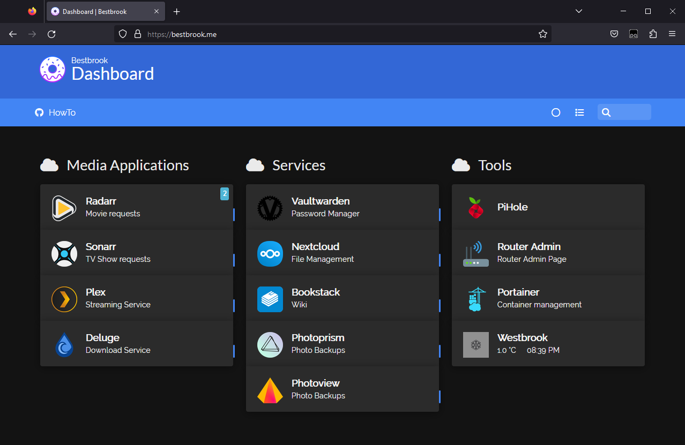
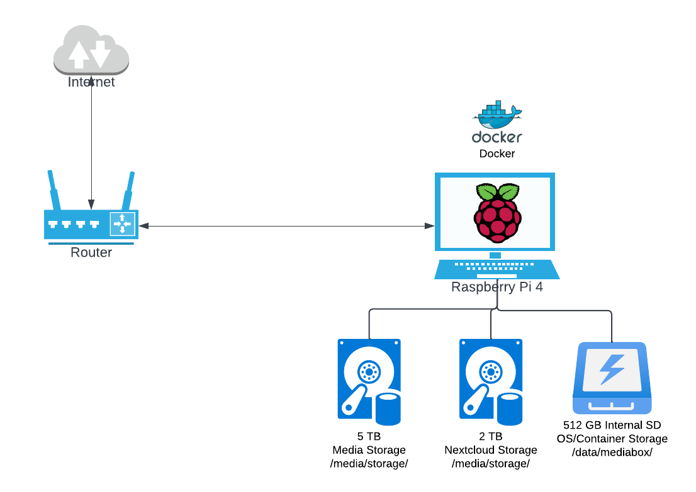

# Mediabox



## What's in the stack?

### Multimedia
* [Plex](https://www.plex.tv/)
* [Sonarr](https://sonarr.tv/)
* [Radarr](https://radarr.video/)
* [Bazarr](https://www.bazarr.media/)
* [Prowlarr](https://github.com/Jackett/Jackett)
* [Deluge](https://deluge-torrent.org/) (built-in dark mode)
* [Portainer 2.0](https://www.portainer.io/)
* [Watchtower](https://github.com/containrrr/watchtower)
* [Bookstack](https://github.com/BookStackApp/BookStack)
* [Homer](https://github.com/bastienwirtz/homer)

### Security
* [OpenVPN](https://github.com/dperson/openvpn-client)
* [Traefik](https://containo.us/traefik/)
* [Let's Encrypt Automatic SSL certificates](https://letsencrypt.org/)
* [Duplicati](https://www.duplicati.com/)

## Prerequisites
* [Docker](https://www.docker.com/)
* [Docker-Compose](https://docs.docker.com/compose/)

## Prequisites setup

### Install docker
``` bash
curl -sSL https://get.docker.com | sh
```

### Create Non-Root User 

```bash
sudo adduser dockeruser
```

### Add a Non-Root User to the Docker group
``` bash
# Add users to the Docker group (ex. pi)
sudo usermod -aG docker dockeruser

# Add permissions for the current user
sudo usermod -aG docker ${USER}

# Check 
groups ${USER}
```

### Install Docker-Compose
Installing python3 and pip3 to run the installer scripts
``` bash
sudo apt-get install libffi-dev libssl-dev
sudo apt install python3-dev
sudo apt-get install -y python3 python3-pip
```

Install docker-compose
``` bash
sudo pip3 install docker-compose
```

### Enable Docker to start your containers on boot
``` bash
sudo systemctl enable docker
```

## Setup
1. Copy `.env.template`
```bash
cp .env.template .env
```
2. Replace variables on `.env` with whatever makes sense to you (follow the comments above each property).
3. It might be a good idea to clone this repo inside the external disk if you plan to use it on different machines/architectures.

## Starting
```bash
# Main stack
docker-compose -f docker-compose.yml up -d

# Main stack + VPN Protected Torrenting
docker-compose -f docker-compose.yml -f docker-compose.torrents-on-vpn.yml up -d

# Main stack + VPN Protected Torrenting + Plex Without Transcoding
docker-compose -f docker-compose.yml -f docker-compose.torrents-on-vpn.yml up -d

# Main stack + VPN Protected Torrenting + Custom domain & SSL certificates
docker-compose -f docker-compose.yml -f docker-compose.torrents-on-vpn.yml -f docker-compose.traefik.yml up -d

# Main stack + VPN Protected Torrenting + Custom domain & SSL certificates + Pihole
docker-compose -f docker-compose.yml -f docker-compose.torrents-on-vpn.yml -f docker-compose.traefik.yml -f docker-compose.pihole.yml up -d

# Main stack + VPN Protected Torrenting + Custom domain & SSL certificates + Pihole + Nextcloud
docker-compose -f docker-compose.yml -f docker-compose.torrents-on-vpn.yml -f docker-compose.traefik.yml -f docker-compose.pihole.yml -f docker-compose.nextcloud.yml up -d

# Main stack + VPN Protected Torrenting + Custom domain & SSL certificates + Pihole + Nextcloud + Bitwarden
docker-compose -f docker-compose.yml -f docker-compose.torrents-on-vpn.yml -f docker-compose.traefik.yml -f docker-compose.pihole.yml -f docker-compose.nextcloud.yml -f docker-compose.bitwarden.yml up -d

# Main stack + VPN Protected Torrenting + Plex HW Transcoding
docker-compose -f docker-compose.yml -f docker-compose.torrents-on-vpn.yml -f docker-compose.plex-hw.yml up -d

```

## Stopping
Use `docker-compose down` adding `-f` flag with the same compose files you used for starting the stack.

## Updating
Watchtower automatically updates all apps (if docker image update is available) at 4 AM every day.

## Custom domain + Let's Encrypt free certificates
In case you own a domain like `example.com` and you'd like to configure subdomains pointing to your apps like `sonarr.example.com` or `plex.example.com`, do the following:
1. Modify `.env`:
```bash
DOMAIN=example.com
SSL_ACME_EMAIL=your_acme_email@address.com
```
2. Forward ports 80 and 443 to your mediabox (you can do that changing your router settings).
3. Include `docker-compose.traefik.yml` when starting the stack
4. Check the logs to verify everything is up and running: `docker logs -f traefik`

## VPN
With OpenVPN you can use any VPN provider following these steps:

1. Download your VPN OpenVPN config files (e.g: [NordVPN TCP/UDP config files](https://nordvpn.com/ovpn/))
2. Download your VPN CA file (e.g: [NordVPN CA & TLS key files](https://downloads.nordcdn.com/configs/archives/certificates/servers.zip))
3. Run the following (using NordVPN US #9255 as example)
4. Copy required cert files for openvpn container
    ```bash
    sudo cp Downloads/tcp9255/us9255.nordvpn.com.tcp443.ovpn /data/mediabox/containers/openvpn/vpn.conf
    sudo cp Downloads/tcp9255/us9255_nordvpn_com_ca.crt /data/mediabox/containers/openvpn/vpn-ca.crt
    ```

5. Copy Credentials file
    ```
    cp Downloads/vpn.auth /data/mediabox/containers/openvpn/vpn.auth
    ```


## Sonarr/Radarr << Deluge/SABnzbd
This setup follows best practices mentioned on [this article](https://wiki.servarr.com/Docker_Guide#The_Best_Docker_Setup), therefore you'll have to map Sonarr/Radarr volumes to Deluge's download path to be able to use hardlinks and/or perform atomic "move" operations instead of "copy+delete" (which takes longer and requires more space).

In my setup, /downloads path on Deluge, Sonarr and Radarr containers is mapped to  /data/mediabox/downloads/torrents/

## Architecture



```bash
# data
# ├── 5tb
# │   └── media (/media/storage/data)
# │       ├── movies
# │       ├── pictures
# │       └── tv
# ├── 2tb
# │   └── Nextcloud docs (/media/docs)
# └── 512gb Internal SD Card 
#     └── mediabox (/data/mediabox)
#         ├── containers
#         ├── downloads
#         └── repo
```

## Deluge Fix

Occassionally, Deluge will fail the VPN connection and the IP Address in the menu on the bottom will display my local IP: 45.46.43.18. This is always bad news as it means that there is a leak.
Re-creating the container sometimes works, but is not very reliable. 

To fix that permanently, I came across a fix on the forum: https://forum.deluge-torrent.org/viewtopic.php?t=49883&start=30

The solution is to modify core.conf in the /data/mediabox/containers/deluge folder to force the *tun0* interface for outgoing and incoming connections.
To do that: 
1. Ensure that docker container is in stopped state
2. Update coreboth **listen_interface** and **outgoing_interface** with value **tun0** on core.conf.
3. Start deluge and verify that the change is in effect

## Homer

Homer is a dead simple static homepage for your server to keep your services on hand, from a simple yaml configuration file.

### Install/Setup
Be sure to read the app specific documentation on github as the environment variables below are an extension of those explained in the documentation.

Note that your configuration files and homer assets are located in ${CONTAINERS}/homer/assets (mapped to /www/assets).

Example of my config is under /homer/assets/config.yml. 

Additionally, I've used a [homer-icons](https://github.com/NX211/homer-icons) repository for icons on my homepage. 
